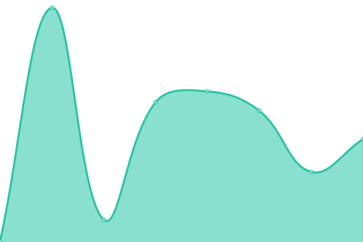

# [📈 Live Status](https://liaocanada.github.io/upptime-health-checker): <!--live status--> **🟧 Partial outage**

This repository contains the open-source uptime monitor and status page for [David Liao](davidliao.ca), powered by [Upptime](https://github.com/upptime/upptime).

With [Upptime](https://upptime.js.org), you can get your own unlimited and free uptime monitor and status page, powered entirely by a GitHub repository. We use [Issues](https://github.com/liaocanada/upptime-health-checker/issues) as incident reports, [Actions](https://github.com/liaocanada/upptime-health-checker/actions) as uptime monitors, and [Pages](https://liaocanada.github.io/upptime-health-checker) for the status page.

<!--start: status pages-->
<!-- This summary is generated by Upptime (https://github.com/upptime/upptime) -->
<!-- Do not edit this manually, your changes will be overwritten -->
<!-- prettier-ignore -->
| URL | Status | History | Response Time | Uptime |
| --- | ------ | ------- | ------------- | ------ |
|  [🧑 Personal Website](https://www.davidliao.ca) | 🟩 Up | [personal-website.yml](https://github.com/liaocanada/monitor/commits/HEAD/history/personal-website.yml) | 

 209ms
     
 | 

<a href="https://liaocanada.github.io/monitor/history/personal-website">100.00%</a>
    

|  [📔 Bookstore App (Frontend)](https://ebookstore.davidliao.ca/) | 🟩 Up | [bookstore-app-frontend.yml](https://github.com/liaocanada/monitor/commits/HEAD/history/bookstore-app-frontend.yml) | 

 205ms
     
 | 

<a href="https://liaocanada.github.io/monitor/history/bookstore-app-frontend">100.00%</a>
    

|  [📔 Bookstore App (Backend)](https://qyoxm4iv68.execute-api.us-east-1.amazonaws.com/ping) | 🟩 Up | [bookstore-app-backend.yml](https://github.com/liaocanada/monitor/commits/HEAD/history/bookstore-app-backend.yml) | 

 191ms
     
 | 

<a href="https://liaocanada.github.io/monitor/history/bookstore-app-backend">100.00%</a>
    

|  [💼 CareerCounsel App (Frontend)](https://app.davidliao.ca) | 🟩 Up | [career-counsel-app-frontend.yml](https://github.com/liaocanada/monitor/commits/HEAD/history/career-counsel-app-frontend.yml) | 

 169ms
     
 | 

<a href="https://liaocanada.github.io/monitor/history/career-counsel-app-frontend">100.00%</a>
    

|  [💼 CareerCounsel App (Backend)](https://api.davidliao.ca) | 🟥 Down | [career-counsel-app-backend.yml](https://github.com/liaocanada/monitor/commits/HEAD/history/career-counsel-app-backend.yml) | 

 0ms
     
 | 

<a href="https://liaocanada.github.io/monitor/history/career-counsel-app-backend">100.00%</a>
    

|  [🔎 Google](https://google.com) | 🟩 Up | [google.yml](https://github.com/liaocanada/monitor/commits/HEAD/history/google.yml) | 

 158ms
     
 | 

<a href="https://liaocanada.github.io/monitor/history/google">100.00%</a>
    

<!--end: status pages-->

[**Visit our status website →**](https://liaocanada.github.io/upptime-health-checker)

## 📄 License

- Powered by: [Upptime](https://github.com/upptime/upptime)
- Code: [MIT](./LICENSE) © [David Liao](davidliao.ca)
- Data in the `./history` directory: [Open Database License](https://opendatacommons.org/licenses/odbl/1-0/)
